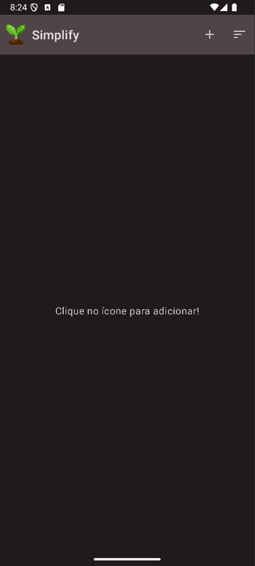
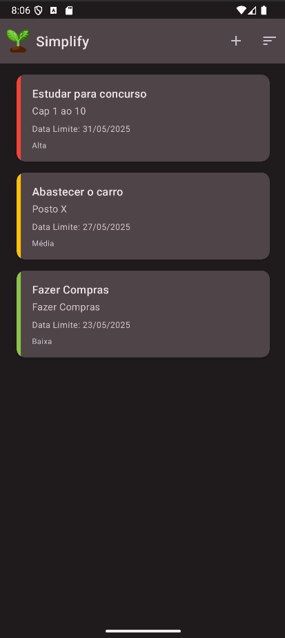
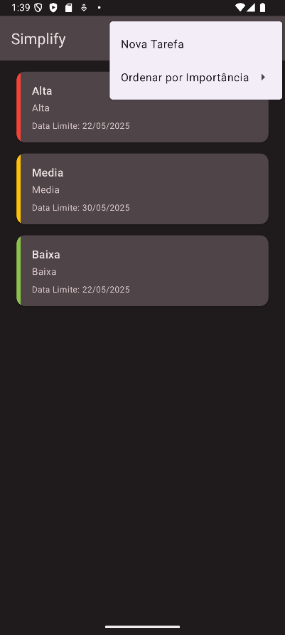
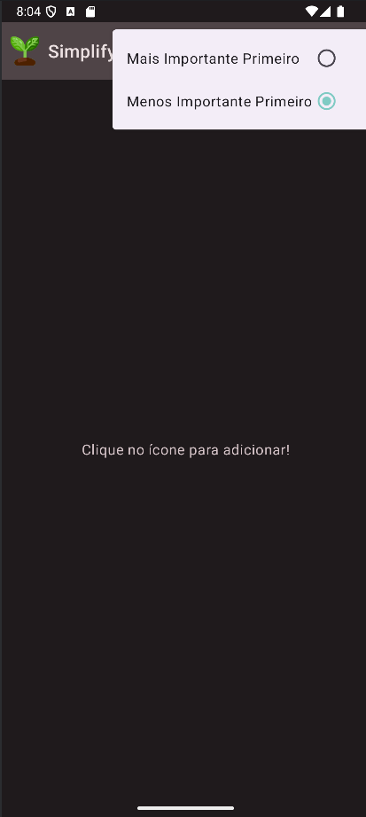
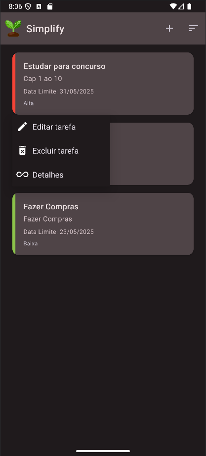
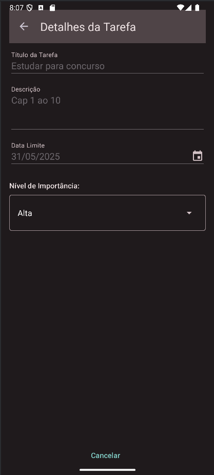
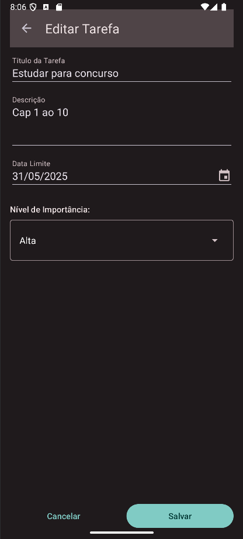

# PersonalTasks

Aplicativo Android para gerenciamento de tarefas pessoais.

**Autor:** Alan Souza  
**Email:** alansouzeesi@gmail.com

## Descrição

O PersonalTasks permite aos usuários criar, visualizar, editar, ordenar e excluir suas tarefas diárias, com persistência local de dados e uma interface de usuário intuitiva.

## Funcionalidades

*   Adicionar novas tarefas com título, descrição, data limite e nível de importância.
*   Listar todas as tarefas cadastradas, ordenadas por importância e data.
*   Editar tarefas existentes.
*   Excluir tarefas.
*   Visualizar detalhes de uma tarefa.
*   Menu de Opções para fácil acesso à criação de tarefas.
*   Menu de Contexto para ações rápidas em itens específicos da lista.
*   Indicador visual de importância na lista de tarefas.
*   Mensagem de estado vazio quando não há tarefas.

## Video Exemplo
https://github.com/user-attachments/assets/55f4c4be-f0f5-4dc2-8904-5c5e631a4af0

## Screenshots

### Tela Principal (Sem tarefas)

---

### Tela Principal (Com tarefas)

---

### Menu de Contexto

---

### Adicionar Nova Tarefa

---

### Ordenar Tarefas
###### (Nota: A ordenação é automática por importância)

---

### Pop-Up para ações

---

### Detalhes das Tasks

---

### Edição de Task

---

### Excluir Task

---

## Instruções de Execução

1.  Clone este repositório: `git clone https://github.com/Alan-VSouza/PersonalTasks.git`
2.  Abra o projeto no Android Studio (versão LadyBug ou superior).
3.  Certifique-se de que o `minSdk` está configurado para API 26 (Android 8.0) ou superior.
4.  Sincronize o projeto com os arquivos Gradle.
5.  Execute o aplicativo em um emulador ou dispositivo Android (API 26+).

## Instruções de Uso

O PersonalTasks foi projetado para ser intuitivo e fácil de usar. Aqui está um guia rápido sobre como interagir com o aplicativo:

**1. Tela Principal (Lista de Tarefas):**
*   Ao abrir o aplicativo, você verá a lista de todas as suas tarefas cadastradas.
*   Se não houver tarefas, uma mensagem indicará que a lista está vazia (como visto na screenshot ["Tela Principal (Sem tarefas)"](#tela-principal-sem-tarefas)).
*   As tarefas são automaticamente ordenadas por nível de importância (Alta, Média, Leve) e, dentro de cada nível, pela data limite mais próxima.
*   Cada item da lista exibe o título, uma prévia da descrição, a data limite e o nível de importância. ([Veja screenshot da lista com tarefas](#tela-principal-com-tarefas))

**2. Adicionar uma Nova Tarefa:**
*   Na tela principal, toque no ícone de três pontos no menu de opções na barra superior.
*   Você deverá clicar em nova tarefa e será redirecionado a uma nova tela. ([Veja screenshot de adicionar nova tarefa](#adicionar-nova-tarefa))
*   Preencha os campos:
    *   **Título:** Um nome curto para sua tarefa.
    *   **Descrição:** Detalhes adicionais sobre a tarefa.
    *   **Data Limite:** Toque no botão "Definir Data Limite" para abrir um calendário (DatePicker) e escolha a data.
    *   **Importância:** Selecione o nível de importância (Alta, Média ou Leve) usando o seletor apropriado.
*   Toque em "Salvar" para adicionar a tarefa à sua lista. A nova tarefa aparecerá na tela principal.
*   Toque em "Cancelar" para descartar as informações e voltar à tela principal.

**3. Interagindo com Tarefas Existentes (Menu de Contexto):**
*   Na tela principal, pressione e segure (clique longo) sobre uma tarefa na lista para abrir o Menu de Contexto (como visto na screenshot ["Pop-Up ações"](#pop-up-para-ações)).
*   Este menu oferece as seguintes opções, que levarão à segunda tela para a ação correspondente:
    *   **Detalhes:** Abre a tela de detalhes da tarefa, onde você pode ver todas as informações da tarefa em modo de visualização (campos não editáveis). ([Veja screenshot de detalhes](#detalhes-das-tasks)).
    *   **Editar tarefa:** Abre a tela de edição da tarefa, com os campos preenchidos com os dados atuais da tarefa, prontos para serem modificados. Faça as alterações desejadas e toque em "Salvar". ([Veja screenshot de edição](#edição-de-task)).
    *   **Excluir tarefa:** Abre a tela de confirmação de exclusão da tarefa. Os detalhes da tarefa são exibidos para sua revisão. Toque em "Confirmar Exclusão" para remover permanentemente a tarefa ou "Cancelar" para voltar. ([Veja screenshot de exclusão](#excluir-task)).

**4. Tela de Cadastro/Edição/Detalhes/Exclusão (Segunda Tela):**
*   Esta tela é multifuncional e se adapta dependendo da ação iniciada na tela principal:
    *   **Nova Tarefa / Editar Tarefa:** Campos de formulário (Título, Descrição, Data Limite com DatePicker, Seletor de Importância) e botões "Salvar" e "Cancelar".
    *   **Detalhes:** Os campos são exibidos, mas desabilitados para edição. O botão principal geralmente é "Voltar" ou similar.
*   Use o botão "Salvar" para aplicar as mudanças e retornar à tela principal, ou "Cancelar" (ou "Voltar") para descartar/ignorar e retornar.

## Arquitetura

O aplicativo utiliza a arquitetura **MVP (Model-View-Presenter)** para separação de responsabilidades, com os seguintes componentes principais:
*   **Model:** Entidade `Task` e classes de acesso a dados (Room DAO e Database).
*   **View:** Activities (`MainActivity`, `TaskDetailActivity`) e interfaces de contrato que definem como a UI deve ser atualizada.
*   **Presenter:** Classes (`MainPresenter`, `TaskDetailPresenter`) que contêm a lógica de apresentação, interagem com o Model e atualizam a View.
*   **LiveData** é utilizado para observar mudanças nos dados e atualizar a UI de forma reativa.

---
